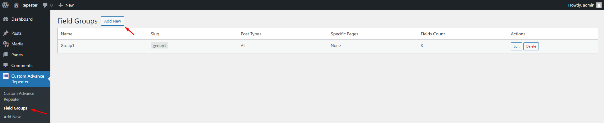
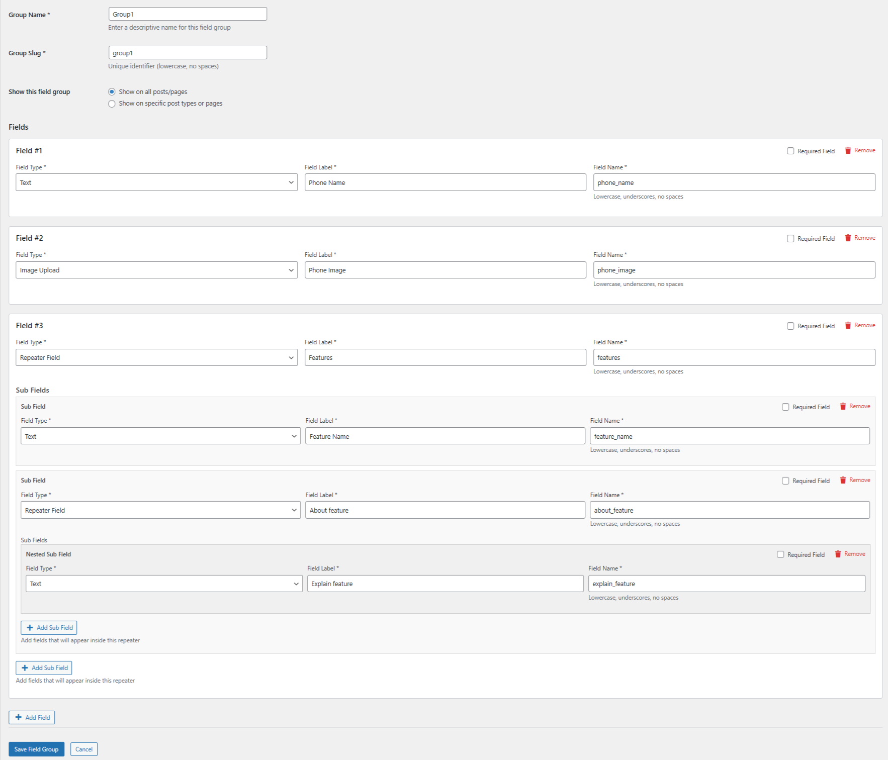
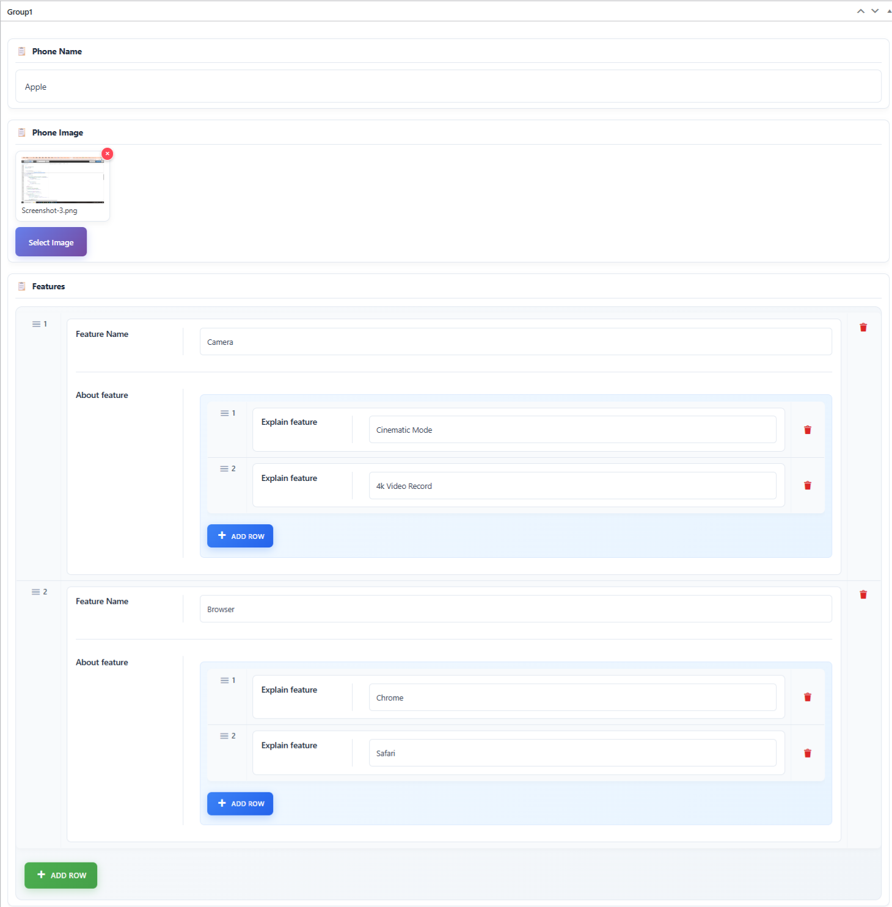
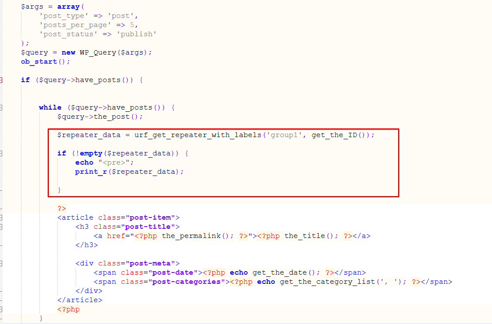
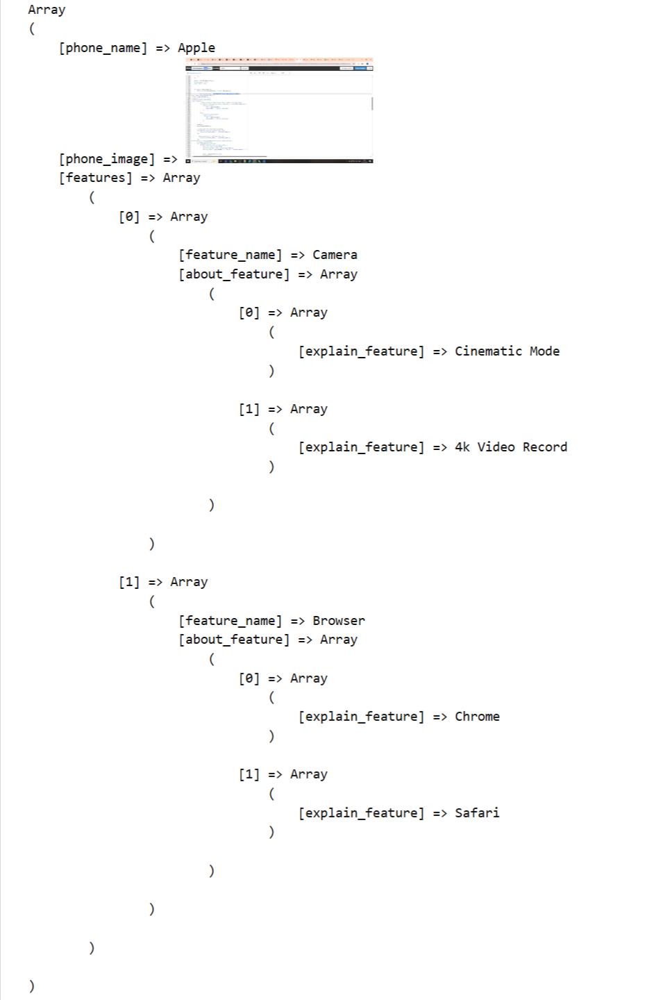

### Creating a Field Group

1. **Create a Group**: 
   - To create a new field group, go to **Custom Advance Repeater > Field Groups** in the WordPress dashboard.
   - Click **"Add New"** to create a new group.
   - Enter the **Group Name** (e.g., "Group1") and the **Slug** (e.g., "group1").
   - Add multiple fields (both Simple and Repeater fields).
   - After entering the necessary details, click **"Save"** to create the group.

  

### Creating and Managing Fields with Ultimate Repeater

After creating the field group, we are provided with several options, including:
- **Display on All Post Types/Pages**: You can choose to display the field group on all posts and pages.
- **Display on Specific Post Types/Pages**: You can opt to show the field group on specific pages or posts.

### Types of Fields:
- **Simple Fields**: These are fields that accept a single entry (e.g.):
  - **Phone Name**: A single text field for the title.
  - **Phone Image**: A field for uploading an image.

- **Repeater Fields**: These sub field allow you to add multiple entries under the Main Field (e.g.):
  - **Features**: A repeater field where you can add multiple features with associated details like Title, images, and others.

- **Second-Level Repeater Fields**: These nrested sub field allow you to add multiple entries under the Sub Field (e.g.)
  - **About feature**: Under Features information, you can add additional feature details such as Title and images etc.

  

### Adding and Managing Data for Posts/Pages

#### Simple Fields:
- These fields only accept one entry (e.g., Title, Image, etc.)
- Just fill in the data once.

#### Repeated Fields:
- These fields allow you to add multiple entries (e.g., Feature Name).
- Click **"Add Row"** to add more entries under the same field.

#### Second-Level Repeated Fields:
- These fields allow you to add multiple entries (e.g., Adding multiple Explain feature).
- Use **"Add Row"** to add more rows for each Explain feature.

  

### Fetching and Displaying Data from a Custom Repeater Field

- The urf_get_repeater_with_labels() function retrieves repeater field data for a specific field group. The 'group1' argument represents the group slug, while get_the_ID() provides the target post ID.
- urf_get_repeater_with_labels('group1', get_the_ID());

  

### The data is now displayed on the frontend, and we can use this data in HTML.

  

